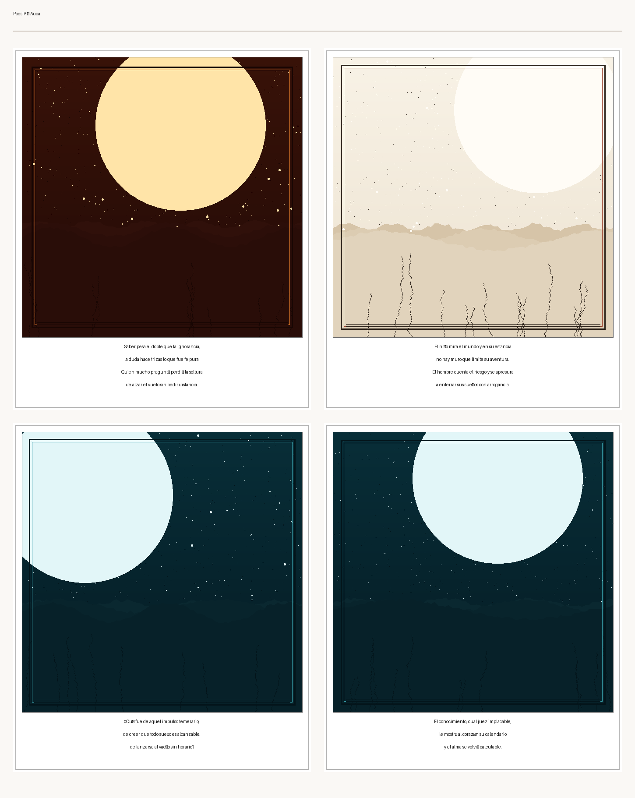
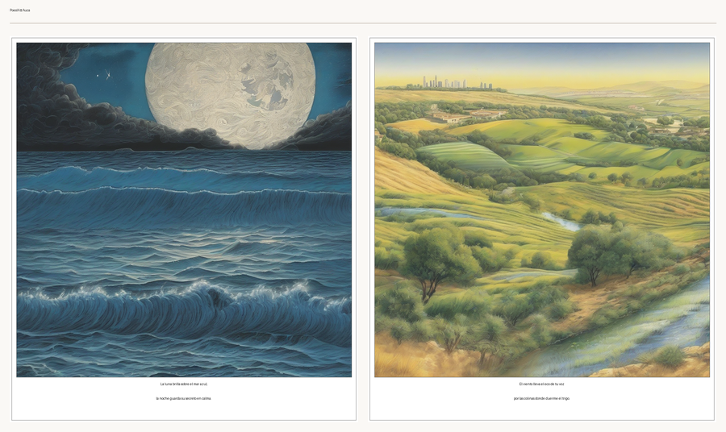

# PoesIA

> *poesía* — Spanish for "poetry" — already contains **IA** (*Inteligencia Artificial*).
> Nothing invented; just noticed.

[](https://www.python.org/)
[](LICENSE)
[](#development)
[](#status)
[](#core-generation)
[](#galeria--illustration)
[](#language-support)
[](#memoria)
[](#tooling)

A **hybrid poetry-writing engine**: deterministic phonology and prosody validation
anchored to LLM semantic generation — extended into sound analysis, illustration,
a personal library, and music.

The thesis is simple and evidence-backed:

> **LLM** for imagination — metaphor, ambiguity, emotional movement.
> **Algorithms** for the craft — syllable count, stress, rhyme, measurable repetition.
> **Human** for taste — whether the poem deserved to exist.

Pure LLM generation produces formally valid poetry less than ~4% of the time.
Wrapping the same generation in deterministic phonological verification raises
validity to ~73%. The exact numbers differ per language; the architectural lesson
does not: **never trust an LLM to count syllables**.

---

## Showcase — GalerIA in action

**Fully offline, deterministic** — every stanza of a poem gets its own image,
captioned with its verses (the Spanish *auca* tradition). The sheet below was
generated for the soneto *"El peso del saber"* with one command: the
`procedural` backend renders **deterministic generative art seeded from the
poem's own imagery** (palette and composition derive from the extracted nouns
and sensory modalities), so the same poem always produces the same
illustration.

```bash
poesia galeria illustrate seeds/library/20260731_030227_142539_el_peso_del_saber__ingenuidad.md \
  --backend procedural --output docs/examples/auca_el_peso_del_saber.png
```

<p align="center">
  
</p>

Four stanzas, four panels, no network, no key.

**Online, real AI, free tier** — the same pipeline against Cloudflare Workers
AI (SDXL, native 1024×1024, ~10 s per panel). This sheet was generated live
from the free tier with a dedicated token:

```bash
poesia galeria illustrate poema.txt --backend cloudflare --output auca.png
```

<p align="center">
  
</p>

Two panels, two real SDXL images, ~20 s, $0. (Cloudflare output is *novel per
request* — the served SDXL ignores the seed; use `procedural` when
bit-for-bit reproducibility matters.)

Full walkthrough in the [GalerIA section](#galeria--illustration).

---

## The -IA family

One package, five commands, all sharing the same phonology/evaluation spine.
Each sub-brand is a real Spanish word ending in *-ía* — read those three letters
as **IA**.

| Command | Word | Role |
|---|---|---|
| `poesia write` · `poesia scan` | *poesía* — poetry | Core generation + validation loop |
| `poesia eufonia analyze` | *eufonía* — euphony | **Sound**: rhyme, assonance, consonance — how a poem *sounds* |
| `poesia galeria illustrate` | *galería* — gallery | **Illustration**: auca-style image sheets, one image per stanza |
| `poesia memoria` | *memoria* — memory | **Collections**: personal library, semantic retrieval, Graph RAG |
| `poesia armonia` | *armonía* — harmony | **Music**: prosody → rhythm, score, sung/recited output |

EufonIA judges how words *sound*; ArmonIA turns the poem into *music*. Neighbours, not synonyms.

---

## Features

### Core generation

- Constrained generation loop: candidate lines → validate → score → rank → LLM repair
- 8+ LLM backends behind one `Protocol` — `stub`, `groq`, `gemini`, `openai`, `ollama`, `lora`, `outlines`, `mlflow`
- Grammar-constrained decoding via Outlines; LoRA/QLoRA fine-tuning (Qwen2.5) with MLflow tracking
- Directive prompts: syllable targets, rhyme word banks, anti-repetition
- Interactive line selection, alternative ranking, privacy guardrails for hosted providers

### Phonology — the deterministic spine

- Spanish sinalefa-aware syllable counting; 45 stanza types; English CMUdict scansion; Dutch pyphen
- Lazy, pluggable backends — no network, no LLM, pure algorithms

### GalerIA — illustration

- One illustrated panel per stanza (the Spanish *auca* / *aleluya* tradition)
- Pluggable image backends: `procedural` (offline generative art), `pollinations` (free online, no key), `cloudflare` (free tier, needs account), `stub`, `openai` (DALL·E), `replicate` (SDXL)
- `procedural` renders deterministic, poem-seeded art with zero API keys — reproducible by design
- `pollinations` adds a free online path (community service, ≈1 image/15 s anonymous) with the same seed-driven reproducibility
- `cloudflare` runs SDXL on Workers AI's free tier (10k neurons/day; reliable infra — but output is novel per request, no seed reproducibility)
- Imagery extraction (nouns, phrases, sensory modalities) → image prompts
- Style anchoring from literary influences and tone
- PNG sheets and WeasyPrint PDF export

### MemorIA

- Markdown + SQLite poem library with full generation provenance in YAML frontmatter
- Graph RAG semantic retrieval with explainable paths; style anchors for your voice

### Tooling

- MLOps: MLflow single source of truth, model registry, evaluation, monitoring, Docker, CI/CD
- 477 passing tests; ruff, mypy, bandit, safety enforced in CI

---

## Installation

Requires **Python 3.11+**.

```bash
git clone <repo-url> poesia
cd poesia
pip install -e ".[dev]"
```

### Optional extras

| Extra | What it enables |
|---|---|
| `.[spanish]` | Spanish phonology (`silabeador`, `fonemas`) |
| `.[english]` | English phonology (`pronouncing`, CMUdict, `prosodic`) |
| `.[nlp]` | Semantic scoring (sentence-transformers) + imagery extraction (spaCy) |
| `.[llm]` | Hosted LLM SDKs |
| `.[illustration]` | Image generation SDKs + Pillow + WeasyPrint (PDF export) |
| `.[graphrag]` | Graph RAG retrieval (NetworkX, Neo4j) |
| `.[music]` · `.[recitation]` | ArmonIA score/TTS extras |
| `.[all-lang]` | All language backends |

---

## Quickstart

**Scan a line** — syllables, stress, validity:

```bash
poesia scan "En el umbral de la noche callada" --language es
```

**Write a poem** — offline, no API key needed:

```bash
poesia write --theme "lluvia sobre piedra" --form soneto --language es
```

**Write and illustrate it in one go** — one image per stanza, saved as an auca sheet:

```bash
poesia write --theme "lluvia sobre piedra" --form soneto --illustrate
# ✓ Illustrated sheet: galeria/lluvia_sobre_piedra_20260803_175942.png
```

With no API keys configured, `--illustrate` falls back to the `procedural`
backend — you still get a real, deterministic sheet.

**Illustrate an existing poem file** with a real image model:

```bash
poesia galeria illustrate poem.txt --backend openai --output auca.png
```

Requires `OPENAI_API_KEY` (or `REPLICATE_API_TOKEN`). `--backend auto` picks the
first configured provider and falls back to the deterministic offline
`procedural` renderer when none is set.

---

## GalerIA — illustration

In the Spanish *auca* tradition, every stanza of a poem gets its own image,
captioned with its verses. PoesIA automates the whole chain:

```
poem lines ──▶ split into stanzas
    ──▶ extract imagery (nouns, phrases, sensory modalities)
    ──▶ build image prompt (theme + imagery + style)
    ──▶ generate one image per stanza  (procedural | stub | openai | replicate)
    ──▶ compose an illustrated sheet   (PNG grid, or WeasyPrint PDF)
```

```bash
poesia galeria illustrate soneto.txt --backend replicate --output auca.pdf
# Generated 4 panels (4 image prompts)
# ✓ Illustrated PDF saved: auca.pdf
```

No API key? `--backend procedural` renders the same panels as deterministic
offline art — the exact command from the [Showcase](#showcase--galeria-in-action).
Want real AI images without paying or signing up? `--backend pollinations`
calls the free, key-less [Pollinations](https://pollinations.ai) service
(≈1 image/15 s anonymously; rate-limited, so 4 panels take about a minute):

```bash
poesia galeria illustrate soneto.txt --backend pollinations --output auca.png
```

Prefer a commercial-SLA free tier? `--backend cloudflare` runs SDXL on
[Cloudflare Workers AI](https://developers.cloudflare.com/workers-ai/) (10,000
neurons/day free). One-line setup — `poesia` loads `.env` from the current
directory automatically:

```bash
cp .env.example .env     # then add CLOUDFLARE_ACCOUNT_ID + CLOUDFLARE_API_TOKEN
poesia galeria illustrate soneto.txt --backend cloudflare --output auca.png
```

Get those two values from the dashboard: **Workers AI → Use REST API → Create a
Workers AI API Token**. Note: Cloudflare output is *novel per request* (the
served SDXL ignores the seed — live-verified) — use `procedural` or
`pollinations` when bit-for-bit reproducibility matters.

`--dry-run` prints the prompts without any rendering, so you can iterate on
style before spending a single token:

```bash
poesia galeria illustrate soneto.txt --backend procedural --dry-run
# Panel 1 — 4 line(s)
#   La luna sobre el agua fría. La noche callada. ...
```

One panel per stanza is the *auca* default — but if you prefer a **single
image for the whole poem**, `--panel-mode poem` builds one longer, holistic
prompt from the entire text (theme + all imagery + style):

```bash
poesia galeria illustrate soneto.txt --backend cloudflare --panel-mode poem \
  --output portada.png
# Generated 1 panels (1 image prompt)
```

The free-provider landscape is evaluated and ranked in
[`docs/IMAGE_GENERATION_PROVIDERS.md`](docs/IMAGE_GENERATION_PROVIDERS.md).

Style anchoring ties the visuals to the poetry itself — literary movements and
tones map to visual keywords (Modernismo → *art nouveau, jewel tones*;
melancholic → *muted colors, twilight*):

```bash
poesia galeria illustrate soneto.txt --style-from-influences --tone melancholic
```

The influence registry also feeds the `procedural` backend, so style anchoring
works fully offline.

---

## Architecture (high-level)

```
┌──────────────────────────────────────────────────────────┐
│                  poesia CLI (Typer)                       │
│     write · scan · eufonia · galeria · memoria · armonia  │
└──────────────┬───────────────────────────────────────────┘
               │
     ┌─────────▼──────────┐
     │  Generation Loop   │   candidate lines → validate → score → repair
     │  (generation/)     │
     └─────┬──────────┬───┘
           │          │
  ┌────────▼───┐  ┌───▼─────────┐   ┌──────────────────────┐
  │ phonology/ │  │ evaluation/ │   │  Feature modules      │
  │ syllable,  │  │ metre, rhyme│   │  eufonia/ galeria/    │
  │ stress,    │  │ theme,      │   │  memoria/ armonia/    │
  │ rhyme keys │  │ novelty     │   │  (Protocol backends)  │
  └────────────┘  └─────────────┘   └──────────────────────┘
```

The discipline: `phonology/` and `evaluation/` are **pure and deterministic**.
Feature modules (`galeria/`, `armonia/`, `memoria/`) talk to the outside world
only through abstract `Protocol` backends — no vendor SDK leaks into core logic.

---

## Language support

| Language | Phonology stack | Forms |
|---|---|---|
| Spanish | `silabeador`, `fonemas`, `phonemizer` | 45 stanza types, soneto, romance… |
| English | `pronouncing` + CMUdict, `prosodic`, `phonemizer` | iambic pentameter, sonnets, haiku, free verse |
| Dutch | `pyphen` | syllabic validation |

---

## Development

```bash
pip install -e ".[dev]"
pytest                       # 477 tests
ruff check src/ mlops/       # lint (CI-enforced)
ruff format --check src/ mlops/
mypy src/ --ignore-missing-imports
```

MLflow experiments, model registry and monitoring run against PostgreSQL
(`docker compose -f docker/docker-compose.yml up`); training entry point:
`bash scripts/launch_training.sh local mlops/configs/train_<config>.yaml`.

**Documentation**: `docs/` — architecture, package survey, roadmap, experiment
plan, RAG/LLM hardening plan, corpus sources, MLOps diagnosis. Full CLI reference
in [`USAGE_GUIDE.md`](USAGE_GUIDE.md).

---

## Status

Core engine complete; Phases 0–5 + P0–P5 hardening done, **477 tests passing**
(2026-08). Fine-tuning and DPO pipelines operational (MLflow-tracked); GalerIA
wired end-to-end for online (DALL·E / SDXL) and offline (`procedural`
deterministic art, no key needed) illustration, with the `image:` link
persisted in the library frontmatter.

---

## License & sharing

- **Software** — MIT, see [`LICENSE`](LICENSE).
- **Original creative content** (`seeds/angel_fragments/`, `seeds/library/`) —
  © the author, **not** covered by the MIT license. See [`NOTICE`](NOTICE).
- **Corpus texts** (`seeds/poetry_corpus/`) — public domain (Project Gutenberg,
  es.wikisource.org); provenance in [`docs/CORPUS_SOURCES.md`](docs/CORPUS_SOURCES.md).

Contribution standards: [`CONTRIBUTING.md`](CONTRIBUTING.md) ·
Security: [`SECURITY.md`](SECURITY.md) · History: [`CHANGELOG.md`](CHANGELOG.md)

**Author:** Angel — shared by invitation; contact details are provided personally.

