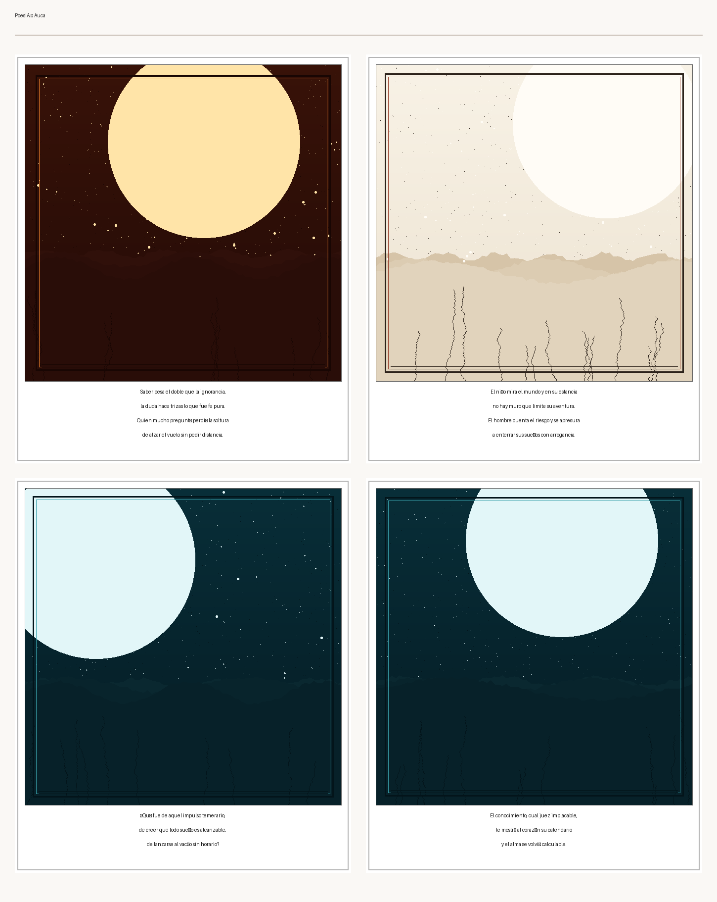

# PoesIA

> *poesía* — Spanish for "poetry" — already contains **IA** (*Inteligencia Artificial*).
> Nothing invented; just noticed.

[](https://www.python.org/)
[](LICENSE)
[](#status)
[-green)](#language-support)

An **instrument for letting things out** — not a poetry generator. You bring what
you carry: a thought, a feeling, a grievance, a joy that never became words.
PoesIA gives it the shape of poetry and, in the shaping, teaches you the craft —
so that it needs you a little less each time.

The machine underneath exists to serve that purpose, and it divides authority on
one principle:

> **You** for meaning — the feeling, the memory, the words only you have.
> **Algorithms** for the craft — syllable count, stress, rhyme, measurable repetition.
> **The machine** for scaffolding — drafts and proposals that are *never* the
> poem; the poem is whatever you decide to keep.

The reason the craft layer is deterministic and not learned: a language model
predicts what a metrically correct line *looks like*; it does not count. Scansion,
sinalefa and stress placement are decidable, so PoesIA decides them in code and
lets the model propose only what code can then check. The generator is never
asked to validate its own output — which is also why the checks can explain
themselves to you, line by line, instead of asserting that something is wrong.

> Why PoesIA exists, who it is for, and the landscape research showing this
> position is unoccupied: [`docs/POSITIONING.md`](docs/POSITIONING.md).

## Who this is for

Everyone with something unexpressed — and **especially people in technical
fields**, who live in a world where feelings rarely become words. PoesIA speaks
your language: it is a *linter for poetry*. Write a line, run the check, read
*why* it fell short, fix it, go green — the same loop as your linter, except the
lint is syllables, stress and rhyme, and the feedback teaches you sinalefa and
scansion. No prior poetry knowledge required.

Four movements, in order:

1. **Outlet** — you drop thoughts, feelings, emotions as they are. Private, no audience.
2. **Shaping** — raw feeling becomes a *made thing*: form, sound, rhythm.
3. **Teaching** — the checks explain *why* and *how to fix*, so every session leaves you more able.
4. **Linking** — you connect to poetry itself, and to your own voice across time.

## The poet's path

Start from what you feel, not from a command.

**0. The whole path, guided.** Outlet → shaping → teaching → linking, in one
sitting. You write what you carry, then shape it line by line — the machine
teaches each line you type and never holds the pen:

```bash
poesia workshop --form soneto --save
```

**1. You write, it teaches.** Drop the line that's stuck in you and get told
*why* it works — or how to fix it. Point it at a form and it teaches against
that form's metre:

```bash
poesia scan "la noche pesa como una losa de silencio" --language es
poesia scan "la noche pesa como una losa" --form soneto   # why, + how to fix
```

**2. You choose, it scaffolds.** Draft line by line; keep the words that feel
like yours, or type your own and let them be scanned and scored:

```bash
poesia write --theme "lo que no pude decir" --form soneto \
  --interactive --show-alternatives 5
```

**3. You finish, it keeps.** Save the poem *you* decided to keep — what the
machine produced was scaffolding; this is yours. PoesIA asks what you were
carrying and stores it beside the poem:

```bash
poesia write --theme "lo que no pude decir" --form soneto --interactive --save
```

**4. You look back, it remembers.** Your voice, across time — the reflection
kept beside each poem:

```bash
poesia memoria list
poesia memoria search silencio
```

The rest of this README documents the machinery behind these four steps.

---

## Showcase — GalerIA in action

**Fully offline, deterministic** — every stanza of a poem gets its own image,
captioned with its verses (the Spanish *auca* tradition). The sheet below was
generated for the soneto *"El peso del saber"* with one command: the
`procedural` backend renders **deterministic generative art seeded from the
poem's own imagery** (palette and composition derive from the extracted nouns
and sensory modalities), so the same poem always produces the same
illustration.

```bash
poesia galeria illustrate seeds/library/20260731_030227_142539_el_peso_del_saber__ingenuidad.md \
  --backend procedural --output docs/examples/auca_el_peso_del_saber.png
```

<p align="center">
  
</p>

Four stanzas, four panels, no network, no key.

**Online, real AI, free tier** — the same pipeline against Cloudflare Workers
AI (SDXL, native 1024×1024, ~10 s per panel). This sheet was generated live
from the free tier with a dedicated token:

```bash
poesia galeria illustrate poema.txt --backend cloudflare --output auca.png
```

<p align="center">
  
</p>

Two panels, two real SDXL images, ~20 s, $0. (Cloudflare output is *novel per
request* — the served SDXL ignores the seed; use `procedural` when
bit-for-bit reproducibility matters.)

Full walkthrough in the [GalerIA section](#galeria--illustration).

---

## The -IA family

One package, five commands, all sharing the same phonology/evaluation spine.
Each sub-brand is a real Spanish word ending in *-ía* — read those three letters
as **IA**.

| Command | Word | Role |
|---|---|---|
| `poesia write` · `poesia scan` | *poesía* — poetry | Core generation + validation loop; `scan` is the **you-write, it-teaches** flow |
| `poesia eufonia analyze` | *eufonía* — euphony | **Sound**: rhyme, assonance, consonance — how a poem *sounds* |
| `poesia galeria illustrate` | *galería* — gallery | **Illustration**: auca-style image sheets, one image per stanza |
| `poesia memoria` | *memoria* — memory | **Collections**: personal library, semantic retrieval, Graph RAG |
| `poesia armonia` | *armonía* — harmony | **Music**: prosody → rhythm, score, sung/recited output |

EufonIA judges how words *sound*; ArmonIA turns the poem into *music*. Neighbours, not synonyms.

---

## Features

### Core generation

- **Human-writes-first**: `scan` teaches each line's syllables, stress and
  *why* — and with `--form`/`--syllables` teaches the exact fix; `--interactive`
  keeps you the editor (choose, or type your own and have it scanned and
  taught) — generation is *scaffolding*, never the finished poem
- **`workshop`**: the four movements guided — outlet → shaping → teaching →
  linking; the poem and your reflection are kept together in memoria
- **Reflection is first-class**: `--save` keeps what you meant or felt beside
  the poem (prompted, or `--reflection`)
- Constrained generation loop: candidate lines → validate → score → rank → LLM repair
- 10 LLM backends behind one `Protocol` — `stub`, `groq`, `gemini`, `openai`, `cloudflare`, `ollama`, `lora`, `llama_cpp`, `outlines`, `mlflow`; the default `route` tries groq → openai → ollama → stub, and `auto` picks the first hosted key (Gemini → Groq → OpenAI)
- Grammar-constrained decoding via Outlines; LoRA/QLoRA fine-tuning (Qwen2.5) with MLflow tracking
- Directive prompts: syllable targets, rhyme word banks, anti-repetition
- Interactive line selection, alternative ranking, privacy guardrails for hosted providers
- **Macaronic word insertion** (`--guest-lang`/`--guest-words`, opt-in): drop a
  word or phrase from another language mid-line into an otherwise
  single-language poem — rhyme and metre are still validated on the host
  language; see [Language support](#language-support)

### Phonology — the deterministic spine

- Spanish sinalefa-aware syllable counting; registered forms soneto, romance, haiku (es) and Shakespearean sonnet, haiku (en); English CMUdict scansion; Dutch pyphen
- Lazy, pluggable backends — no network, no LLM, pure algorithms

### GalerIA — illustration

- One illustrated panel per stanza (the Spanish *auca* / *aleluya* tradition)
- Pluggable image backends: `procedural` (offline generative art), `pollinations` (free online, no key), `cloudflare` (free tier, needs account), `stub`, `openai` (DALL·E), `replicate` (SDXL)
- `procedural` renders deterministic, poem-seeded art with zero API keys — reproducible by design
- `pollinations` adds a free online path (community service, ≈1 image/15 s anonymous) with the same seed-driven reproducibility
- `cloudflare` runs SDXL on Workers AI's free tier (10k neurons/day; reliable infra — but output is novel per request, no seed reproducibility)
- Imagery extraction (nouns, phrases, sensory modalities) → image prompts
- Style anchoring from literary influences and tone
- PNG sheets and WeasyPrint PDF export

### MemorIA

- Markdown + SQLite poem library with full generation provenance in YAML frontmatter
- Graph RAG semantic retrieval with explainable paths; style anchors for your voice

### Tooling

- MLOps: MLflow single source of truth, model registry, evaluation, monitoring, Docker
  files (images not rebuilt since the Python 3.13 switch), CI/CD (`train.yml` needs a
  self-hosted GPU runner that does not exist yet)
- CI enforces ruff, mypy, bandit and pip-audit on the installed dependencies, and runs the test suite with hosted-LLM and hosted-image tests excluded so a run needs no API keys and no GPU; the training stack is installed as a CPU build

---

## Installation

Requires **Python 3.13**.

### Python version

One version everywhere (decided 2026-10-04): the conda env (`environment.yml`, 3.13.14 on
both machines), CI, the Docker images, and the online-training fallbacks (Colab and Kaggle
run 3.13 since September 2026). `pyproject.toml` enforces it with
`requires-python = ">=3.13,<3.14"`. Move to 3.14 deliberately, in all of these at once.
Workspace policy: `ci-infra/docs/ENVIRONMENT.md` "Version policy" (3.13 for GPU envs).

Dependency impact, from resolving every extra on 3.11–3.14 (2026-10-04):

- **Gained:** numpy 2.5, scipy 1.18, networkx 3.7 and contourpy 1.4 need ≥3.12. CI on 3.11
  had been testing numpy 2.4 and scipy 1.17 against an env on 2.5 and 1.18.
- **Planned extras that 3.13 affects** (none is imported yet; all are on the roadmap in
  `docs/ARCHITECTURE.md`):
  - `classical` (CLTK, Latin/Greek scansion): cltk 1.x has the scanners but requires
    <3.13; cltk 2.x installs but has no scansion. Open: port cltk 1.5's MIT-licensed
    `prosody/lat` or find another scanner.
  - `recitation`: now `piper-tts` 1.8.0, which synthesizes Spanish on 3.13 in this stack.
    Coqui `TTS` requires <3.12, and its fork `coqui-tts` 0.27.5 resolves but fails to
    import with transformers 5 (upstream issue #558; fix PR #592 unreleased). Revisit
    when coqui-tts ships that fix.
  - `music-ai`: now MusicGen through `transformers` (+ `scipy` to write WAV), verified on
    3.13 with Hugging Face's tiny MusicGen test checkpoint. `audiocraft` pins torch 2.1 and
    av 11, so it installs on no current stack, 3.11 included.
- 3.14 resolves the same as 3.13 for every extra.

```bash
git clone https://github.com/OomAngel/poesia.git
cd poesia
scripts/env.sh create          # conda env for this machine's GPU tier ("Machines" below)
# without conda, on Python 3.13: pip install -e ".[dev]"
```

### Optional extras

| Extra | What it enables |
|---|---|
| `.[spanish]` | Spanish phonology (`silabeador`; `fonemas` comes from `environment.yml`) |
| `.[english]` | English phonology (`pronouncing`, CMUdict, `prosodic`, `g2p_en`) |
| `.[phonology-multi]` | Multilingual phonology (`phonemizer`, `epitran`) |
| `.[phonology-extra]` | Lightweight phonology backends (`gruut`, `g2p_en`, `pyphen`) |
| `.[lexical-extra]` | Rhyme/word discovery via the Datamuse API |
| `.[nlp]` | Semantic scoring (sentence-transformers) + imagery extraction (spaCy), `wn`, `wordfreq` |
| `.[llm]` | Local LLM stack: transformers, llama-cpp-python (CPU wheel; GPU build via `scripts/build_llama_cpp.sh`), guidance, outlines. Hosted backends need no SDK |
| `.[illustration]` | Image generation SDKs + Pillow + WeasyPrint (PDF export) |
| `.[illustration-local]` | Local image generation (`diffusers`) |
| `.[graphrag]` | Graph RAG retrieval (NetworkX, Neo4j) |
| `.[music]` | ArmonIA symbolic score and MIDI (`music21`, `pretty_midi`, `mido`, `pyfluidsynth`) |
| `.[mlops]` | MLflow (`mlflow==3.14.0`, same pin as `environment.yml`) |
| `.[dev]` | pytest, ruff, mypy, bandit |
| `.[all-lang]` | All language backends |
| `.[recitation]` | **Planned, not yet imported by code:** `piper-tts`. Recitation at runtime uses eSpeak NG |
| `.[music-ai]` | **Planned, not yet imported by code:** MusicGen through `transformers` (+ `scipy`) |
| `.[classical]` | **Planned, not yet imported by code:** `cltk`; on 3.13 that is cltk 2.x, which has no scansion |

### Machines

The repository is worked on from two machines through Git. Each gets the best environment
its hardware supports, built from a diagnosis of that machine (`scripts/hw_profile.sh`, a
copy of `~/dev/workspace-governance/bin/hw-profile`; the workspace-wide reference is
`~/dev/workspace-governance/MACHINES.md`).

| | desktop | laptop |
|---|---|---|
| GPU | RTX 3070, 8 GB, compute capability 8.6 | Quadro M1000M, 2 GB, compute capability 5.0 |
| Tier (`scripts/hw_profile.sh`) | `gpu-cuda13` | `gpu-cuda12` |
| torch | 2.14.0+cu130 | 2.14.0+cu126 (the newest build with sm_50) |
| Train adapters (QLoRA, DPO) | yes (no training run on it yet) | no: 2 GB, and bitsandbytes needs compute capability ≥ 6.0 |
| `--llm lora` (transformers + bitsandbytes 4-bit) | yes (the adapters are not on the desktop yet) | no |
| `--llm llama_cpp` (GGUF on the GPU) | yes: prebuilt CUDA 13.0 llama-cpp-python wheel (sm_86); `poesia-gpu` not built here yet | yes: llama-cpp-python compiled for sm_50 with a CUDA 12.x `nvcc`; generation and sampling were tuned here |
| Adapter evaluation (`scripts/evaluate_adapter_mlflow.py`) | through `LoRAClient` | through llama.cpp (chosen automatically) |
| Embeddings (sentence-transformers) | GPU | GPU (torch cu126 has sm_50) |

Two conda envs, with the same names on both machines (on the desktop only `poesia` exists
so far; `poesia-gpu` is not built yet):

- `poesia`: `environment.yml` (hardware-neutral base) plus `requirements/<tier>.txt`
  (torch for the tier; on the desktop also bitsandbytes, trl and datasets for training).
- `poesia-gpu`: the same plus llama-cpp-python built for this machine's GPU, for the
  llama.cpp backend. It is kept apart because that build is tied to one GPU architecture.

```bash
scripts/env.sh create --dry-run     # plan + conda/pip resolution; changes nothing
scripts/env.sh create               # or: update (same flags)
scripts/env.sh check                # torch has sm_<arch> and runs on the GPU; bitsandbytes on the desktop
scripts/build_llama_cpp.sh --dry-run
scripts/build_llama_cpp.sh          # creates poesia-gpu if needed, installs llama.cpp for this GPU
scripts/build_llama_cpp.sh --check  # imports, GPU offload, and a GGUF smoke test if models/ has one
HW_PROFILE=gpu-cuda12 scripts/env.sh create --dry-run   # any tier's layer, from either machine
```

What the repository records about the laptop: evaluation and generation tuning through
llama.cpp, no training. The llama.cpp backend was added for it (8c50e34); the draft prompt,
token caps and `repeat_penalty` were tuned against the local GGUF (e697ac0, 10a9c9a); the
benchmark and the adapter evaluations ran there (db9d065, d6c0446; MLflow runs
2026-08-30 to 09-01). The adapters themselves were trained 2026-07-28 to 08-07
(`mlops/adapter_registry.json`), before any of that.

**Verify on the laptop, then record here:**

- [ ] `scripts/hw_profile.sh` says `gpu-cuda12`, Quadro M1000M, compute capability 5.0;
      note the driver version (it must stay on the 580 branch or older).
- [ ] `nvcc --version` (or `/usr/local/cuda*/bin/nvcc`): which CUDA 12.x release built
      the sm_50 llama.cpp? CUDA 13 cannot target sm_50.
- [ ] `conda env list`: which env holds llama-cpp-python? The repository never names it;
      `poesia-gpu` is assumed from `docs/TRAINING_RUNBOOK.md`'s history and the
      "GPU-specific build env" of `src/poesia/generation/llama_cpp.py`. If it differs,
      correct this section (or set `POESIA_LLAMA_ENV`).
- [ ] In that env: `python -c "import llama_cpp; print(llama_cpp.__version__, llama_cpp.llama_supports_gpu_offload())"`.
      If a rebuild of 0.3.35 fails on sm_50, pin `LLAMA_CPP_PYTHON_VERSION` to this version.
- [ ] The llama.cpp checkout `scripts/convert_adapters_to_gguf.py` uses:
      `scripts/setup_gguf_tools.sh --check`. If the laptop's checkout is at another commit,
      note it before replacing it (`scripts/setup_gguf_tools.sh` pins the commit
      llama-cpp-python 0.3.35 vendors; the desktop has it since 2026-09-27).
- [ ] GGUF files: `ls -la models/*/*-Q4_K_M.gguf`, and `dvc status -c` against the remote
      on the laptop's D: drive (`LOCAL_ONLY.md`).
- [ ] `scripts/build_llama_cpp.sh --check --env <that env>`: GGUF smoke test on the GPU
      with every layer offloaded. Does the 3B Q4_K_M fit in 2 GB, or only the 1.5B ones?
- [ ] Any fine-tuning of weights on the laptop? The repository records none (above). If
      there was, find it (`mlruns/mlflow.db`, `models/*/` newer than 2026-08-07) and record it.
- [ ] Then build the tiered envs: `scripts/env.sh create --dry-run`, `scripts/env.sh create`,
      `scripts/build_llama_cpp.sh --dry-run`, `scripts/build_llama_cpp.sh`, both `--check`s.

---

## Quickstart

The human-first flows from [The poet's path](#the-poets-path), condensed:

**Write a line, get taught** — syllables, stress, and *why* (the teaching voice):

```bash
poesia scan "En el umbral de la noche callada" --language es
```

**Draft with scaffolding, keep the editor's seat** — choose or type each line
(`t` = type your own), the machine keeps the metre honest:

```bash
poesia write --theme "lluvia sobre piedra" --form soneto --language es --interactive
```

**Generate a draft** — offline, no API key needed. This is *scaffolding*, never
the finished poem — the poem is what you keep:

```bash
poesia write --theme "lluvia sobre piedra" --form soneto --language es
```

**Write and illustrate it in one go** — one image per stanza, saved as an auca sheet:

```bash
poesia write --theme "lluvia sobre piedra" --form soneto --illustrate
# ✓ Illustrated sheet: galeria/lluvia_sobre_piedra_20260803_175942.png
```

With no API keys configured, `--illustrate` falls back to the `procedural`
backend — you still get a real, deterministic sheet.

**Illustrate an existing poem file** with a real image model:

```bash
poesia galeria illustrate poem.txt --backend openai --output auca.png
```

Requires `OPENAI_API_KEY` (or `REPLICATE_API_TOKEN`). `--backend auto` picks the
first configured provider and falls back to the deterministic offline
`procedural` renderer when none is set.

---

## GalerIA — illustration

In the Spanish *auca* tradition, every stanza of a poem gets its own image,
captioned with its verses. PoesIA automates the whole chain:

```
poem lines ──▶ split into stanzas
    ──▶ extract imagery (nouns, phrases, sensory modalities)
    ──▶ build image prompt (theme + imagery + style)
    ──▶ generate one image per stanza  (procedural | pollinations | cloudflare | stub | openai | replicate)
    ──▶ compose an illustrated sheet   (PNG grid, or WeasyPrint PDF)
```

```bash
poesia galeria illustrate soneto.txt --backend replicate --output auca.pdf
# Generated 4 panels (4 image prompts)
# ✓ Illustrated PDF saved: auca.pdf
```

No API key? `--backend procedural` renders the same panels as deterministic
offline art — the exact command from the [Showcase](#showcase--galeria-in-action).
Want real AI images without paying or signing up? `--backend pollinations`
calls the free, key-less [Pollinations](https://pollinations.ai) service
(≈1 image/15 s anonymously; rate-limited, so 4 panels take about a minute):

```bash
poesia galeria illustrate soneto.txt --backend pollinations --output auca.png
```

Prefer a commercial-SLA free tier? `--backend cloudflare` runs SDXL on
[Cloudflare Workers AI](https://developers.cloudflare.com/workers-ai/) (10,000
neurons/day free). One-line setup — `poesia` loads `.env` from the current
directory automatically:

```bash
cp .env.example .env     # then add CLOUDFLARE_ACCOUNT_ID + CLOUDFLARE_API_TOKEN
poesia galeria illustrate soneto.txt --backend cloudflare --output auca.png
```

Get those two values from the dashboard: **Workers AI → Use REST API → Create a
Workers AI API Token**. Note: Cloudflare output is *novel per request* (the
served SDXL ignores the seed — live-verified) — use `procedural` or
`pollinations` when bit-for-bit reproducibility matters.

`--dry-run` prints the prompts without any rendering, so you can iterate on
style before spending a single token:

```bash
poesia galeria illustrate soneto.txt --backend procedural --dry-run
# Panel 1 — 4 line(s)
#   La luna sobre el agua fría. La noche callada. ...
```

One panel per stanza is the *auca* default — but if you prefer a **single
image for the whole poem**, `--panel-mode poem` builds one longer, holistic
prompt from the entire text (theme + all imagery + style):

```bash
poesia galeria illustrate soneto.txt --backend cloudflare --panel-mode poem \
  --output portada.png
# Generated 1 panels (1 image prompt)
```

The free-provider landscape is evaluated and ranked in
[`docs/IMAGE_GENERATION_PROVIDERS.md`](docs/IMAGE_GENERATION_PROVIDERS.md).

Style anchoring ties the visuals to the poetry itself — literary movements and
tones map to visual keywords (Modernismo → *art nouveau, jewel tones*;
melancholic → *muted colors, twilight*):

```bash
poesia galeria illustrate soneto.txt --style-from-influences --tone melancholic
```

The influence registry also feeds the `procedural` backend, so style anchoring
works fully offline.

**Style from your own library** — the same idea, but anchored in the poems you
have already saved: `--style-from-retrieval` embeds the current poem/theme,
retrieves the semantically-similar library poems, and maps their imagery and
sensory texture to visual keywords:

```bash
poesia galeria illustrate soneto.txt --style-from-retrieval
# Style from retrieval: musical rhythm, echoing space, vivid color, luna, agua
```

Requires a retrieval index (`poesia memoria ingest-all` + the `.[nlp]` extra).
Without one, the flag degrades gracefully — it prints a note and illustrates
with the base style.

---

## Architecture (high-level)

```
┌──────────────────────────────────────────────────────────┐
│                  poesia CLI (Typer)                       │
│     write · scan · eufonia · galeria · memoria · armonia  │
└──────────────┬───────────────────────────────────────────┘
               │
     ┌─────────▼──────────┐
     │  Generation Loop   │   candidate lines → validate → score → repair
     │  (generation/)     │
     └─────┬──────────┬───┘
           │          │
  ┌────────▼───┐  ┌───▼─────────┐   ┌──────────────────────┐
  │ phonology/ │  │ evaluation/ │   │  Feature modules      │
  │ syllable,  │  │ metre, rhyme│   │  eufonia/ galeria/    │
  │ stress,    │  │ theme,      │   │  memoria/ armonia/    │
  │ rhyme keys │  │ novelty     │   │  (Protocol backends)  │
  └────────────┘  └─────────────┘   └──────────────────────┘
```

The discipline: `phonology/` and `evaluation/` are **pure and deterministic**.
Feature modules (`galeria/`, `armonia/`, `memoria/`) talk to the outside world
only through abstract `Protocol` backends — no vendor SDK leaks into core logic.

---

## Language support

| Language | Phonology stack | Forms |
|---|---|---|
| Spanish | `silabeador`, `fonemas`, `phonemizer` | soneto, romance, haiku |
| English | `pronouncing` + CMUdict, `prosodic`, `phonemizer` | Shakespearean sonnet (iambic pentameter), haiku |
| Dutch | `pyphen` | none registered yet — `write`/`workshop` will reject `--language nl`; `scan --language nl` works standalone for syllable/stress checking |

`prosodic` is listed above as aspirational: it's declared as an optional
dependency and referenced in comments, but not currently installed or wired
into any code path (see [Optional extras](#optional-extras) for the dependency
groups and which of them are still only planned).

### Macaronic word insertion

`write` can drop a word or short phrase from another (*guest*) language
mid-line into an otherwise single-language (*host*) poem — off by default,
opt-in only:

```bash
poesia write --theme "the weight of silence" --form haiku --language en \
  --guest-lang es --guest-words "silencio"
```

- **You choose the word** — `--guest-words` is a comma-separated list; the
  system never invents which foreign word to insert, only where it lands.
- **Mid-line only (v1)**: the guest word is placed in the middle of a line,
  never as the line's last word, so rhyme extraction (which still runs on
  the host language alone) is never corrupted by a word it can't parse.
  Metre *is* still fully validated across the mixed line — a dedicated
  `scan_mixed_line` helper scans the host and guest spans separately, through
  their own phonology backends, and recombines the syllable/stress counts.
- **Currently backed languages** (i.e. valid for both `--language` and
  `--guest-lang`): `es`, `en`, `nl`. Any pairing among these works today
  (e.g. English host with a Spanish guest word, or vice versa).
- **Not yet backed**: Latin and Chinese pinyin guest words — no phonology
  backend exists for either yet (`pyphen` has no Latin dictionary; `cltk`
  2.x dropped its old scansion module; pinyin would need a new dependency
  like `pypinyin`). Requesting them raises a clear error rather than
  silently mis-scanning.
- One guest word is assigned per line, spread evenly across the poem
  (e.g. 2 guest words in a 14-line sonnet land around lines 5 and 10, not
  clustered at the start).

---

## Development

```bash
pip install -e ".[dev]"
pytest                       # 519 pass on the desktop (2026-10-04); CI runs 446 on 3.13, 0 skipped (hosted-provider and hosted-image test files excluded)
ruff check src/ mlops/       # lint (CI-enforced)
ruff format --check src/ mlops/
mypy src/ --ignore-missing-imports
```

MLflow experiments, model registry and monitoring use PostgreSQL as the
canonical backend (`docker compose -f docker/docker-compose.yml up`) — though
the historical runs currently live in the local SQLite store
(`mlruns/mlflow.db`), since the docker Postgres only holds MLflow's demo traces
(see [`docs/INFRASTRUCTURE_DECISIONS.md`](docs/INFRASTRUCTURE_DECISIONS.md) §7).
Model weights (`final_adapter/` + `*-Q4_K_M.gguf`) are versioned with DVC
(remote `local_d_drive`); training entry point:
`bash scripts/launch_training.sh local mlops/configs/train_<config>.yaml`.

**Documentation**: `docs/` — the human position
([`POSITIONING.md`](docs/POSITIONING.md)), the comparative
[UX reference](docs/UX_REFERENCE.md), architecture, package survey, roadmap,
corpus sources, MLOps diagnosis,
[training runbook](docs/TRAINING_RUNBOOK.md),
[retraining plan](docs/RETRAINING_PLAN_2026-10.md); archived plans in `docs/archive/`
(the cross-repo README standard and audit moved to the author's private governance repo,
2026-10-05). Full CLI reference
in [`USAGE_GUIDE.md`](USAGE_GUIDE.md); what a clone lacks (DVC data, secrets) in
[`LOCAL_ONLY.md`](LOCAL_ONLY.md).

---

## Status

Core engine complete; Phases 0–5 and P0–P5 hardening done (2026-08). Fine-tuning and DPO pipelines operational (MLflow-tracked); GalerIA
wired end-to-end for online (DALL·E / SDXL) and offline (`procedural`
deterministic art, no key needed) illustration, with the `image:` link
persisted in the library frontmatter.

### Status — 2026-10-04 (desktop `AngelThuis`)

- **Python 3.13 everywhere** (decided 2026-10-04): conda env, `pyproject.toml`, CI, the
  Dockerfiles, Colab and Kaggle (see [Python version](#python-version)).
- **CI green:** 446 tests on 3.13, 0 skipped (CI installs mlflow and a CPU training stack);
  519 pass locally.
- **Corpus:** `seeds/poetry_corpus/corpus_master/poems.jsonl` (`scripts/build_corpus.py`):
  85,027 poems (49,128 English, 35,899 Spanish), DVC-tracked. The new data is cached on the
  desktop only; the one DVC remote (the laptop's D: drive) does not have it
  ([`LOCAL_ONLY.md`](LOCAL_ONLY.md)).
- **Retraining decided:** larger corpus, larger base model —
  [`docs/RETRAINING_PLAN_2026-10.md`](docs/RETRAINING_PLAN_2026-10.md). Next: the Qwen3-8B
  smoke test on the RTX 3070.

### Status log — 2026-09-29 (desktop `AngelThuis`, gpu-cuda13)

Covers 2026-09-25 … 29. Running tracker: `memory-bank/activeContext.md`.

**Environment on this PC (checked 2026-09-29):** `poesia` conda env built by
`scripts/env.sh` for gpu-cuda13: Python 3.13.14, torch 2.14.0+cu130, transformers
5.14.1, peft 0.21.0, trl 1.14.0, bitsandbytes 0.50.2, accelerate 1.15.0, outlines 1.3.3,
optuna 5.0.0, mlflow 3.14.0, dvc 3.67.1 — all as pinned. GGUF tools
(`scripts/setup_gguf_tools.sh`): llama.cpp 4df29be + `llama-quantize` in
`~/.local/share/llama.cpp`. **Missing:** the `poesia-gpu` env (llama-cpp-python 0.3.35
cu130, `scripts/build_llama_cpp.sh`; its build was blocked by the permission check on
2026-09-26).

**Verified here:** 515/515 tests; `env.sh check` runs a CUDA op and a real NF4
bitsandbytes quantize on the RTX 3070 (`7b93e16`); tiny Qwen2 → GGUF f16 → Q4_K_M
(`c851128`); llama.cpp full GPU offload only in a scratch venv (`44ef203`).

**GPU goals: in the env but never run on this PC** — QLoRA training of the 1.5B/3B
configs, DPO, HPO, `--llm lora` with a real adapter. **Doc-only** — `--llm llama_cpp` on
the GPU (needs `poesia-gpu`), the Qwen2.5-3B / Llama 3.2 3B / Gemma 2 2B experiments,
local diffusers for GalerIA, the CI GPU training job (`train.yml` targets a self-hosted
GPU runner; none exists). **Blocked upstream** — Unsloth (caps torch < 2.13).

**Advanced (pushed):** per-tier env split (`379942d` … `a809103`), llama.cpp/GGUF tooling
(`44ef203`, `c851128`), 4-bit device dispatch (`7b93e16`), tests and CI hygiene, docs
(`f64fa77`).

**Pending / known missing:**
- Build `poesia-gpu`; bump the Hugging Face stack (sentence-transformers 6 is a major).
- GitHub CI red since at least 2026-09-27 (checked on `2503818`): the CPU test job
  does not install mlflow, so `tests/test_mlflow_wiring.py` fails (438 others pass);
  pre-commit's `no-plaintext-secrets` flags two placeholder URLs,
  `.env_mlflow.example:12` (`mlflow:mlflow@localhost`) and `docs/CRONOLOGIA_CLOUD.md:62`
  (`user:pass`) — not leaked secrets, but the hook has no allowance for them.
- Training prerequisites absent here: model adapters (`models/` holds only `.dvc`
  pointers; ≈9.5 GB on the laptop), the DVC remote `/mnt/d/dvc-remotes/poesia` (does not
  exist on this PC; a network remote is proposed in `LOCAL_ONLY.md`), the training corpus
  (restorable byte-identical from `git f8b2017^`), Qwen2.5-1.5B/3B weights (only the
  1.5B tokenizer is cached). The first desktop run needs smaller batches.
- Dedupe the corpus before training; Model Registry aliases (`memory-bank/tasks.md`).
- Uncommitted, not from this log: `docs/LEMONADE_INTEGRATION.md` and a `memory-bank/tasks.md`
  change (2026-09-28, "plan, not started").
- Laptop: documentation only; the checklist under "Machines" is unchecked.

---

## License & sharing

- **Software** — MIT, see [`LICENSE`](LICENSE).
- **Original creative content** (`seeds/angel_fragments/`, `seeds/library/`) —
  © the author, **not** covered by the MIT license. See [`NOTICE`](NOTICE).
- **Corpus texts** (`seeds/poetry_corpus/`) — DVC-tracked, never in git. They include
  copyrighted sources, used for personal training only and never redistributed;
  provenance in [`docs/CORPUS_SOURCES.md`](docs/CORPUS_SOURCES.md).

Contribution standards: [`CONTRIBUTING.md`](CONTRIBUTING.md) ·
Security: [`SECURITY.md`](SECURITY.md) · History: [`CHANGELOG.md`](CHANGELOG.md)

**Author:** Angel — public repository at
[github.com/OomAngel/poesia](https://github.com/OomAngel/poesia).
